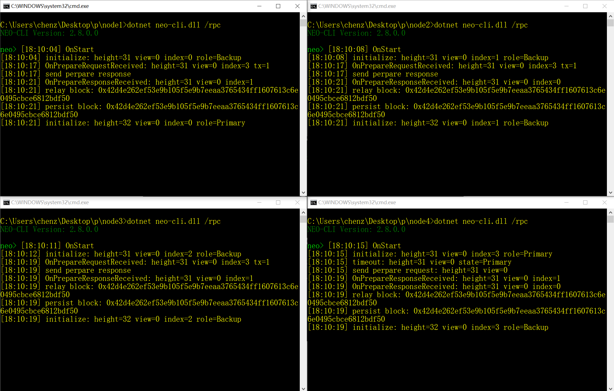
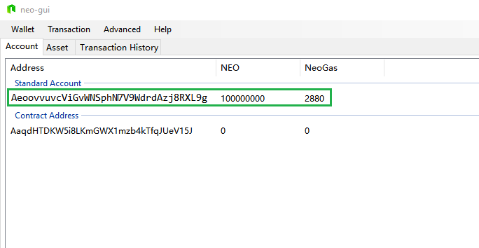

# Build a private chain on local host

In previous document we described the standard way to build a private chain using four computers or virtual machines. In this document we will introduce an easier way to build a private chain on a windows system computer.

> [!Note]
>
> [Here](https://github.com/chenzhitong/NEO-Private-Net) is a private chain which is all set for you to use directly. The NEO and GAS have been withdrawn. The NEO node version is 2.9.4.

## Installing NEO node

Install NEO-CLI and make four copies of the node folder with the name of node1, node2, node3, and node4, successively.

For more information refer to [Installation of NEO-CLI](../../node/cli/setup.md). 

## Installing plug-in

Install [SimplePolicy](https://github.com/neo-project/neo-plugins/releases/) the plug-in to enable the consensus policy. The nodes cannot reach a consensus without the plug-in. For more information, refer to [Installing plug-ins](../../node/cli/setup.md).

## Creating wallet files

From NEO-CLI or NEO-GUI create four wallets, 1.json, 2.json, 3.json, and 4.json, and place each in the folder of four nodes. 

## Modifying config.json

Make the following configurations in config.json of each node:

- Specify the ports so that each port is not duplicated and is not occupied by other applications.
- In "UnlockWallet" specify the wallet path and wallet password.
- Set  StartConsensus and IsActive as true.


You can refer to the following example：

**node1/config.json**

```json
{
  "ApplicationConfiguration": {
    "Paths": {
      "Chain": "Chain_{0}",
      "ApplicationLogs": "ApplicationLogs_{0}"
    },
    "P2P": {
      "Port": 10001,
      "WsPort": 10002
    },
    "RPC": {
      "Port": 10003,
      "SslCert": "",
      "SslCertPassword": ""
    },
    "UnlockWallet": {
      "Path": "1.json",
      "Password": "11111111",
      "StartConsensus": true,
      "IsActive": true
    }
  }
}
```

**node2/config.json**

```json
{
  "ApplicationConfiguration": {
    "Paths": {
      "Chain": "Chain_{0}",
      "ApplicationLogs": "ApplicationLogs_{0}"
    },
    "P2P": {
      "Port": 20001,
      "WsPort": 20002
    },
    "RPC": {
      "Port": 20003,
      "SslCert": "",
      "SslCertPassword": ""
    },
    "UnlockWallet": {
      "Path": "2.json",
      "Password": "11111111",
      "StartConsensus": true,
      "IsActive": true
    }
  }
}
```

**node3/config.json**

```json
{
  "ApplicationConfiguration": {
    "Paths": {
      "Chain": "Chain_{0}",
      "ApplicationLogs": "ApplicationLogs_{0}"
    },
    "P2P": {
      "Port": 30001,
      "WsPort": 30002
    },
    "RPC": {
      "Port": 30003,
      "SslCert": "",
      "SslCertPassword": ""
    },
    "UnlockWallet": {
      "Path": "3.json",
      "Password": "11111111",
      "StartConsensus": true,
      "IsActive": true
    }
  }
}
```

**node4/config.json**

```json
{
  "ApplicationConfiguration": {
    "Paths": {
      "Chain": "Chain_{0}",
      "ApplicationLogs": "ApplicationLogs_{0}"
    },
    "P2P": {
      "Port": 40001,
      "WsPort": 40002
    },
    "RPC": {
      "Port": 40003,
      "SslCert": "",
      "SslCertPassword": ""
    },
    "UnlockWallet": {
      "Path": "4.json",
      "Password": "11111111",
      "StartConsensus": true,
      "IsActive": true
    }
  }
}
```

## Modifying protocol.json

Configure the following parameters in each node protocol.json. Ensure the configuration in each file is consistent.

- Magic : The private chain ID, which can be any integer in the range of [0 - 4294967295].

- StandbyValidators: The public key of the alternate consensus node. Enter the public keys of four wallets.

- SeedList: The IP address and port number of the seed node. Specify the IP address as `localhost` and the ports as four P2P ports configured before in config.json.


You can refer to the following example：

```json
{
  "ProtocolConfiguration": {
    "Magic": 123456,
    "AddressVersion": 23,
    "SecondsPerBlock": 15,
    "StandbyValidators": [
      "037ebe29fff57d8c177870e9d9eecb046b27fc290ccbac88a0e3da8bac5daa630d",
      "03b34a4be80db4a38f62bb41d63f9b1cb664e5e0416c1ac39db605a8e30ef270cc",
      "03cc384ca982168bf6f08922d27c8acc4357d52a7e8ad8281d4af6683e6f63e94d",
      "03da4ed85a991134bf45592a5b04d6d71399f23a85843f43e6ac1a5d30f5473711"
    ],
    "SeedList": [
      "localhost:10001",
      "localhost:20001",
      "localhost:30001",
      "localhost:40001"
    ],
    "SystemFee": {
      "EnrollmentTransaction": 10,
      "IssueTransaction": 5,
      "PublishTransaction": 5,
      "RegisterTransaction": 100
    }
  }
}
```

## Creating a shortcut to start

Create a notepad file for ease of starting the private chain. In the file, enter `dotnet neo-cli.dll /rpc`  , rename it as 1Run.cmd, and then place it under the folder of each node.

At this point the private chain has been set up. All the files  we modified are as follows:

```
├─node1
│      1.json
│      1Run.cmd
│      config.json
│      protocol.json
│
├─node2
│      1Run.cmd
│      2.json
│      config.json
│      protocol.json
│
├─node3
│      1Run.cmd
│      3.json
│      config.json
│      protocol.json
│
└─node4
        1Run.cmd
        4.json
        config.json
        protocol.json
```

## Starting the private chain

Enter each node directory and double-click `1Run.cmd`. When the consensus process goes as shown below, the private chain is set up successfully.



The private chain is terminated if you close all the windows. 

## Withdrawing NEO/GAS

In the genesis block of the NEO network, 100 million NEOs are generated. Additionally, GAS is generated with the generation of new blocks. When the private chain is set up, you can withdraw those NEO and GAS from a multi-party address with NEO-GUI or NEO-CLI, to facilitate your blockchain development and testing.

### Withdrawing NEO and GAS using Neo-CLI

Here we want to use a normal node to connect to the private net and withdraw NEO and GAS.

#### Installing and configuring a normal node

1. Copy any of the consensus node files and name it node0

2. Configure the config.json file：

   - make sure the port is not conflict with the ports of other four nodes.
   - leave the parameters  `Path` and `Password` in UnlockWallet blank 
   - set `StartConsensus` and `IsActive` back to `false`

3. Copy all the four wallets files created in previous steps into the node0 root directory.

4. Run node0 , open a wallet and enter `show state` to check the node state.

   When the block height increases and the connected number is not 0, the node is successfully connected.

   

   > [!Note]
   >
   > One of the four consensus nodes must be closed for the normal node to connect to the private net. 

#### Creating multi-party signature addresses

1. Open a wallet from node0

2. Create a multi-signature address using the command `import multisigaddress m pubkeys`:

   - `m`: the minimal number of signatures needed to complete the transaction
   - `pubkeys`: the public keys in StandbyValidators in all consensus node wallets.

   > [!Note]
   >
   > You must create the multi-party signature address in each wallet so that the transfer transaction can be signed successfully.

3. Enter the command `list asset` and you can see 100 million NEO showing up.

#### Transferring NEO to a normal address

Here we want to send NEO from the contract address to the normal address.

1. Use the command `send <id|alias> <address> <value>` with the normal address of the wallet desired

2. Copy the SignatureContext and close the wallet.

   

3. Open another wallet listed on the multi-signature

4. Use the command `sign <jsonObjectToSign>` with the object copied in step 2

5. Copy the object in Signed Output and close the wallet.

   

6. Repeat the previous steps the number of times put as minimal. Then you can use `relay <jsonObjectToSign>` and your wallet is ready.

   

7. Use `list asset` to check the wallet balance:

   

The GAS status becomes available as NEO is transferred. You can use the command `show gas` to check the claimable GAS amount. Then you can refer to the preceding steps to withdraw GAS from the multi-party signature address.

### Withdrawing NEO and GAS using Neo-GUI

#### Installing and configuring Neo-GUI

1. Download  [Neo-GUI](https://github.com/neo-project/neo-gui/releases) from Github and extract the file.
2. Configure the file protocol.json under the Neo-gui folder to connect the client to the private chain:
   - `StandbyValidators`：enter the public keys of four wallets created before.
   - `SeedList`：enter the four virtual machines IP addresses here and leave the port number as it is.
3. Configure the file config.json to make sure the Neo-GUI port is not conflict with the ports of other four nodes. If using the same port, Neo-GUI cannot work as Neo-CLI is running.

Start Neo-GUI and open any of the wallets, if you see the connection number in the lower left corner is not 0 and the client has been downloading the blocks, the client has been successfully connected to the private chain.

#### Creating multi-party signature addresses

From Neo-GUI, open four wallets in turn and do the following:

1. Right-click on the blank area of account page, click `Create Contract Address` -> `Multi-Signature`.

2. Enter the four public keys and set the minimum number of signatures to 3 (the number of consensus nodes/2 + 1). Click `Confirm`. 

   

3. Click Wallet -> Rebuild wallet index.

   > [!Note]
   >
   > You must create the multi-party signature address in each wallet so that the transfer transaction can be signed successfully  .

Now you should see the contract address has 100 million Neo shares.


#### Transferring NEO to a normal address

Here we want to send the NEO from the contract address to the normal address. 

1. From any of the four wallets, click `transaction`->`transfer` 

2. Enter the recipient address and 100 million NEO as the transfer amount

3. The system prompts you that there have not been enough signatures to complete the transaction. Copy the code to your clipboard.

4. Open the second wallet, click `transaction`->`signature` and paste the code that you have just copied. 

5. Click `signature` and copy the code. 

6. Open the third wallet, click `transaction`->`signature` and paste the code that you have just copied. Click  `signature` . 

   At this time you will notice a pop-up window that displays a `broadcast` button in the lower left corner, which means all the signatures required to send the transaction have been collected. 

7. Click `broadcast`. 

   Once the transfer transaction begins broadcasting it will take a while for successful remittance to the account.


#### Transferring GAS to a normal address

Open the wallet you want to transfer GAS to and click `Advanced`->`Claim GAS`-> `Claim`. 

> [!Note]
>
> GAS has two status, available and unavailable. Once NEO is spent (i.e. transferred out) from the account, the relevant GAS turns to available. Therefore you can transfer GAS to your own account to make them available.


The next operation is similar to the transfer of the NEO. Copy the code that has insufficient signatures, open the second wallet and the third wallet successively to complete transaction signing and broadcasting. 

After successful extraction the GAS will enter the first standard address of the wallet (i.e. the top wallet address) where you initiated the extraction of the GAS, as shown.

