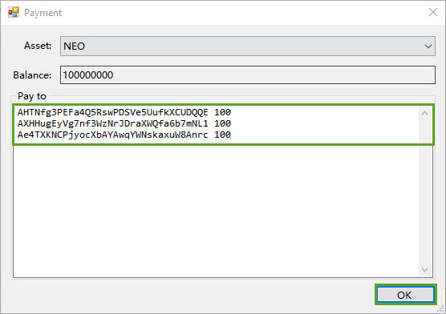
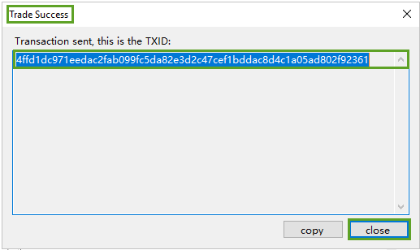
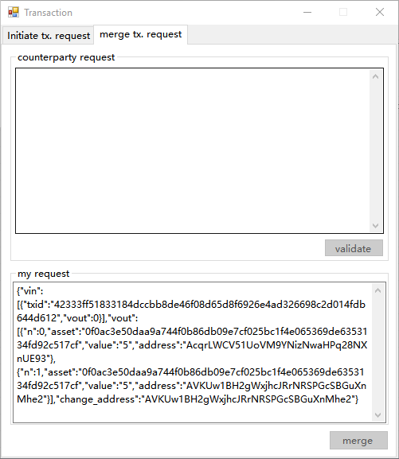

# Transactions

## Transfer

Transfers assets to a recipient address. If the transferred asset type is equity, both parties are required to confirm with their signature.

1. From NEO-GUI, click  `Transaction`-> `Transfer`

2. Do one of the following:

   1. To transfer to a single address, click  `+` and enter the transfer information, e.g. assets type, recipient address, and amount.
   2. To transfer to a batch of addresses, click  and enter pairs of the address and amount separated by a space, as shown below: 

   

3. Click `OK`. If need be, click   to enter transaction related information that will be recorded on the NEO blockchain.  

4. Double-check the transfer information and then click `OK`.

   For token asset transfer, the transaction is completed with the transaction ID displayed.

   

   For equity asset transfer, signatures are required for completing the transaction. Copy the  transaction information that appears and send it to the other party. The other party of the transaction needs to sign and broadcast in NEO-GUI to complete the transaction. For more information, refer to [Signature](#signature).

## Signature

Signing of information, is to signify confirmation of the information by the signer.
For transactions involving equity allocation and asset exchange, the signature is required as proof of consent by the parties involved.

1. From NEO-GUI, click `Transaction` -> `Sign`,

2. Paste the transaction information sent by the other party in the input field, and then click `sign`. The output data is generated. 

   At the same time, the `Broadcast` button is displayed.

   

3. Click  `Broadcast`. The transaction is sent successfully and will be completed once confirmed by NEO blockchain.

## Assets Exchange

An online asset exchange between two parties require both parties to sign for the transaction before the successful exchange of asset can occur. For example, a general asset exchange process between the transaction parties A and B is:

1. Both parties initiate a transaction request and send the generated request to each other
2. Verify the request received
3. Merge transaction requests from both parties, generate signatures and send them to each other
4. Sign and broadcast the transaction.

### Step 1 - Initiating a request

Take the operations made on A side as an example:

1. From NEO-GUI, click `Transaction` -> `Transaction`.

2. Enter the other party's account information and then click `+` to enter the asset to be sent.

3. Click `Initiate` to generate the transaction request. Cope the request that appears and send it to B. Then click `Close`.

   

4. The merging request page is displayed. Wait for the transaction request sent from B.

   B performs the same operations and send the request to A.

### Step 2 - Merging the request

Take the operations made on A side as an example:

1. In the merging request page, paste the request sent from B into the counterparty request field. Click `Validate`.

   

2. Verify the transaction information. Click `Accept` if no issue.

3. Click `Merge` to merge both parties' requests and generate the signature.

4. Copy the signature information and send it to B.

5. B performs the same operations and send the signature to A.

### Step 3 - Signing and broadcasting the transaction

The two sides sign and broadcast the transaction information to complete the process. For more information, refer to [signature](#signature).

## NEP-5 Assets

The NEO-GUI client supports NEP-5 assets transactions. To make a NEP-5 asset transaction, you first need to click `Advanced` -> `Options` in the client to add a script hash for the NEP-5 asset. Then you can select the NEP-5 asset type for asset transfer and exchange transactions.