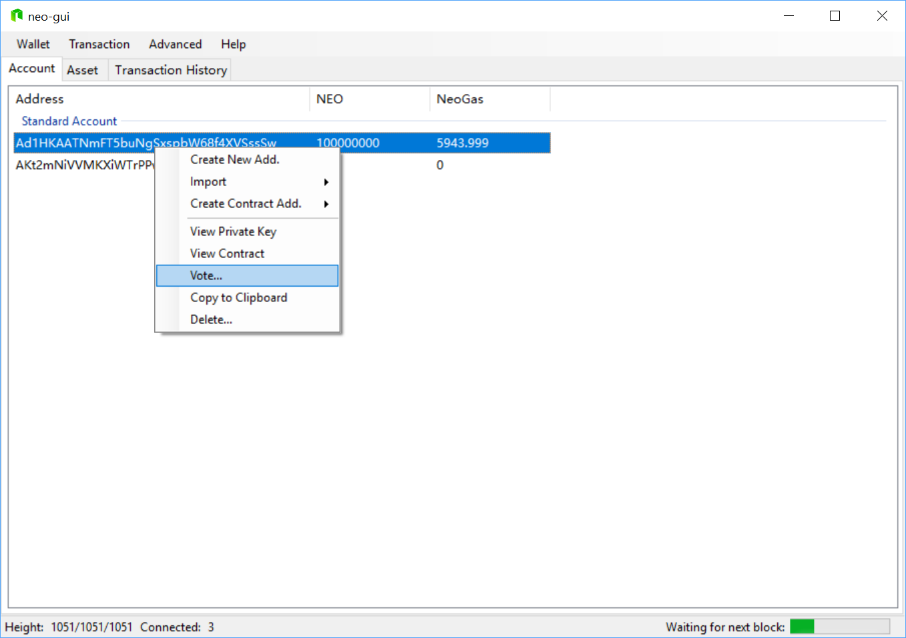

# Election and Voting

Using NEO-GUI you can elect candidates and vote for NEO consensus nodes. After all the NEO consensus nodes reach a consensus through the DBFT algorithm, new blocks are generated. Voting for consensus nodes is conducted constantly in real time in the NEO blockchain. The main process is:

1. NEO nodes register as candidates
2. NEO token holders vote for candidates
3. NEO blockchain determines the consensus nodes based on the number of candidates and their votes cast.

## Election

After the candidates are registered, the NEO token holders can vote for consensus nodes. It costs 1000 GAS for candidate registration.

To register as a candidate:

1. In NEO-GUI, open the wallet account from which you are going to register, and click `Advanced` -> `Election`.
2. Select the public key of the account in the list and click `OK`. Note that 1000 GAS will be charged at this step.

A message is displayed prompting the transaction is constructed successfully. Then you can check if the candidate has been successfully registered using the API [getvalidators](../..reference/rpc/latest-version/api/getvalidators.md). As shown in the figure below, the candidates' public keys are displayed in the returned json response text.

## Voting

Each NEO node can vote for the candidates. The number of NEO in the current voting account will be automatically calculated as the number of the candidate's votes. When voting for multiple candidates, each candidate gets the votes equal to the NEO number of the current voting account. For example, if there are 100 NEO in the current account and three candidates are voted for from this account, each candidate receives 100 votes. If NEO in the account is spent after the vote, the candidates' votes will simultaneously be decreased to the current NEO balance.

After voting, the NEO network calculates in real time based on the number of candidates  cast by each account and determines the consensus nodes. The calculation method is: 

1. Sort the number of the candidates each account voted for by size, e.g. C1, C2, ..., Cn 
2. Remove the first 25% and the last 25% of the data in the array 
3. Calculate the weighted average of the remaining 50% data, which is then determined as the current NEO consensus node number N 
4. The top N candidates with the highest number of votes become consensus nodes  

To vote:  

1. In NEO-GUI, open the wallet account to vote. Right-click on the account -> `Vote`. 
2. In the Candidates field, enter the public key of the candidate to vote. You can enter multiple public keys separated by Line feeds. Note that each line cannot contain spaces, as shown in the following figure:

On clicking OK a message is displayed prompting the transaction is constructed successfully.  You can use the API [getvalidators](../..reference/rpc/latest-version/api/getvalidators.md) to check the candidate votes. As shown in the figure below, the account with the balance of 100000000 voted for the candidate with the public key 03076fc0ee6c6ccf3fb0c9b3ff9d0e3d9ba7ef97e54c77240991ec1dffa295503b. Using the API [getvalidators](../..reference/rpc/latest-version/api/getvalidators.md) you can see the public key and the corresponding votes are displayed in the returned response text.

