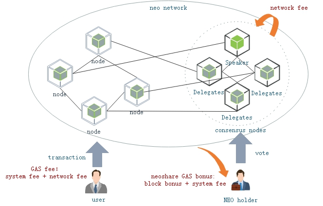

# Charging Model

Participants in NEO economy need to pay network fees and system fees with GAS when using the NEO network. Network fee is paid to consensus node as new block incentive. System fee and new GAS generated in each block belongs to NEO holders. NEO holders can claim gas with `ClaimTransaction`. Fee distribution rule is as follows:

According to contents in sector "Transaction", the GAS sum of inputs and outputs of a transaction can be easily calculated separately. Total fee can be calculated from GAS change:

Total fee = Network fee + System fee = sum(GAS in inputs) - sum(GAS in outputs)

### **Network Fee**

Network fee is the fee to package transactions into a block. User can define the amount of network fee. Theoretically the higher network fee per byte is, the easier corresponding transaction is to be put into a block. On the current main network, a block supports up to 500 transactions, including up to 20 free transactions.

### **System Fee**
System fee is the fee for consumed network resources in NEO network. It can be divided in 2 parts. Firstly, system fee of special transactions can be set in configuration file `protocol.json`, including: 

| Transaction Type      |  System Fee   |
|-----------------------|---------------|
| EnrollmentTransaction |      1000     |
| IssueTransaction      |       500     |
| PublishTransaction    |       500     |
| RegisterTransaction   |     10000     |

Secondly, when a smart contract is run, the resulting system call or virtual machine execution of instructions will incur a fee. Such fee is also system fee. About detailed fee standard please refer to "Smart Contract" chapter.

