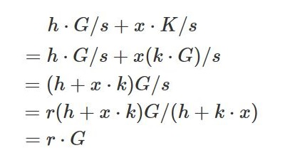

# Encrypt Algorithm

## ECC Algorithm

Elliptic Curve Cryptography (ECC) algorithm is a kind of asymmetric cryptography algorithm. With the irreversible feature of K=k*G process (K: public key, G: base point (constant)), it can prevent solving private key from public key by brutal force. With the same length of secret key, ECC has higher security level and saves computing power compared to other cryptography algorithms such as RSA. ECC combined with other algorithms, is widely used in signing fields, i.e. ECDSA digital signature.

Same as Bitcoin, NEO adopts ECC as public key generating algorithm. NEO defines a special secp256r1-standard elliptic curve with parameters:

Prime Ｑ: 00FFFFFFFF00000001000000000000000000000000FFFFFFFFFFFFFFFFFFFFFFFF

Parameter Ａ: 00FFFFFFFF00000001000000000000000000000000FFFFFFFFFFFFFFFFFFFFFFFC

Parameter B: 005AC635D8AA3A93E7B3EBBD55769886BC651D06B0CC53B0F63BCE3C3E27D2604B

Order Ｎ：00FFFFFFFF00000000FFFFFFFFFFFFFFFFBCE6FAADA7179E84F3B9CAC2FC632551

Base Point G：(0x6B17D1F2E12C4247F8BCE6E563A440F277037D812DEB33A0F4A13945D898C296,
　　　　　0x4FE342E2FE1A7F9B8EE7EB4A7C0F9E162BCE33576B315ECECBB6406837BF51F5)

Example:

| Name | Value |
| --- | --- |
| private key |  c7134d6fd8e73d819e82755c64c93788d8db0961929e025a53363c4cc02a6962 |
| public key (compressed) |  035a928f201639204e06b4368b1a93365462a8ebbff0b8818151b74faab3a2b61a |
| <nobr>public key(uncompressed)</nobr> | 045a928f201639204e06b4368b1a93365462a8ebbff0b8818151b74faab3a2b61a 35dfabcb79ac492a2a88588d2f2e73f045cd8af58059282e09d693dc340e113f |

> [!NOTE]
>
> Uncompressed public key above is in single line.

Scenarios:

- Generating public key with private key

- Signing and signature verification

Reference：

A relatively easy to understand primer on elliptic curve cryptography](https://arstechnica.com/information-technology/2013/10/a-relatively-easy-to-understand-primer-on-elliptic-curve-cryptography/)

## ECDSA signing

Elliptic curve digital signature algorithm (ECDSA) is a simulation of Digital Signature Algorithm (DSA) by ECC algorithm. Its advantage includes fast speed, reliable strength and short signature.

Brief steps are as follows:

Assume private key, public key and base point as k, K and G, respectively. We know that K = k*G according to ECC algorithm.

Signing procedure:

   1. Select random number r and compute point r·G(x, y).

   2. Compute s = (h + k·x)/r according to random number r, message M's hash value h, private key k.
    
   3. Send message M and signature {r·G, s} to receiver.

Verification procedure:

   1. Receiver receives message M and signature {r·G=(x,y), s}.

   2. Compute hash h according to received message.
   
   3. Compute h·G/s + x·K/s with sender public key K and compare with r·G. Verification succeeds if both are the same.

Deduction is as follows:

Example:

| Name | Value                                                         |
| ---- | ------------------------------------------------------------ |
| Message | Hello World                                                  |
| Private Key | f9be359876aac462df9ec642e5d063140daedb83aefc0f8657b08132d3da62d2 |
| Public Key | 04ed08d3bc46390a54350d841c8110ca02f9e357f8ba08702078de2d7041727 5956e94045d041a2bf89be25d5a56ddcf15c4f629d5a1db32657d0da13ebde64b29 |
| Signature | 54a6faec9159e98d45f5868e5799762de290c3e7e67e013c1bd6a2a6f8a2e500 a4d29567359bd171ddebc547dcddd670fb6b367e3e19298d7672f0422b5a2c52 |

> [!NOTE]
>
> public key and signature above is in single line.

Scenarios：

- Transaction signature.

- Consensus.

## AES Encryption

Advanced Encryption Standard (AES) is a kind block cipher algorithm in symmetric cryptography algorithms. It's block size can be 128, 192, 256. AES's advantages include: (1) fast processing speed, (2) whole process can be described in math, (3) Currently no effective cracking method.

NEO uses 256-bit AES encryption algorithm, where encryption mode is ECB and filling method is NoPadding.

Example：

  1. msg,key----->passphrase-protected msg

　　(Message: 256-bit hash of "Hello World") + (password: 256-bit hash of "l love coding")

　　="a591a6d40bf420404a011733cfb7b190d62c65bf0bcda32b57b277d9ad9f146e"

　　　+"da04fe4405fc021e4ca5ca956b263828e99d4ce2a342b2cbdc919baddbe178ae"

　　---->"a8158a64c1e9d776e12582d8c63553ee0c7687bd8e374f79c766e7459577f547"

  2. passphrase-protected msg,key----->msg

　　Ciphertext + (password: 256-bit hash of "l love coding")

　　="a8158a64c1e9d776e12582d8c63553ee0c7687bd8e374f79c766e7459577f547"

　　　+"da04fe4405fc021e4ca5ca956b263828e99d4ce2a342b2cbdc919baddbe178ae"

　　---->"a591a6d40bf420404a011733cfb7b190d62c65bf0bcda32b57b277d9ad9f146e"

Scenarios：

Storage and verification of DB3 wallet account password