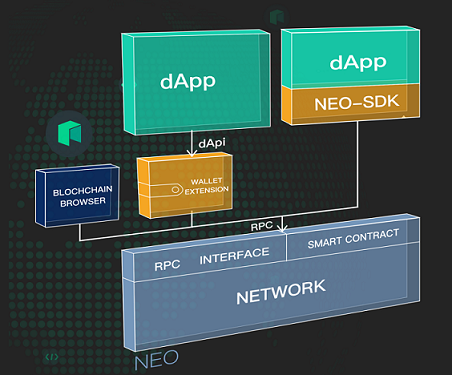

# DApp 集成

开发者完成智能合约的开发和测试后，需要进行 DApp 和区块链的集成开发。本节我们将介绍如何实现 DApp 和Neo 区块链的交互，如 DApp 如何获取 Neo 区块链上的信息，如何调用部署在链上的智能合约等。

上面的结构图显示了 DApp 和区块链的关系。如图中橙色部件所示，DApp 可以通过以下方式和区块链交互：

- 在 DApp 中使用 NEO-SDK，通过 RPC 请求和区块链交互；
- 通过调用钱包插件提供的 DAPI 和区块链交互；

## 基本交互功能

DApp 和区块链交互的基本功能如下表所示，除此之外不同的 SDK 和钱包插件可能会提供更多的功能，详情请参考开发者使用的集成工具。

| 功能     | 基本功能     | 介绍                                                         |
| -------- | ------------ | ------------------------------------------------------------ |
| 钱包功能 | 创建钱包     | 创建一个新的 Neo 钱包                                        |
|          | 导入钱包     | 导入已有的钱包，可以通过钱包文件、私钥/wif、或者 NEP2 私钥+密码导入 |
|          | 查询资产余额 | 通过钱包地址，查询该钱包拥有的数字资产及余额                 |
|          | 转账         | 向其他钱包地址转账（包括 NEO, GAS 和 Nep5 资产）             |
| 智能合约 | 调用智能合约 | DApp 把需要上链的逻辑通过智能合约来实现，需要时通过调用合约来执行 |
| 信息查询 | 区块信息     | 查询区块链的任何区块信息                                     |
|          | 交易信息     | 查询区块链的任何交易的详细信息                               |
|          | 执行日志     | 针对某一笔交易，查询详细的执行日志和事件                     |

## DApp 集成工具

为了方便开发者快速开发与 Neo 区块链交互的 DApp，Neo 开发社区提供了 NEO-SDK 和支持 DAPI 的钱包插件，开发者可以根据需求选择适合的集成方式。

### neo-sdk

neo-sdk 为开发者提供了相对简易和灵活的使用方式，为开发者包装了包括钱包、数字资产交易以及调用智能合约等功能，开发者只需要在 DApp 项目中引入相应的 neo-sdk 即可使用。

SDK 支持以下交互功能：

- 钱包
- 交易
- 合约调用
- 区块链信息查询

Neo 开发者社区提供了以下语言的 Neo-SDK 供开发者选择使用：

- JavaScript:

  neon-js：[Github](https://github.com/CityOfZion/neon-js)，[使用文档](http://cityofzion.io/neon-js/en/)

- Java

  neow3j：[Github](https://github.com/neow3j/neow3j)，[使用文档](https://neow3j.io/#/)

- C#

  neo-lux：[Github](https://github.com/CityOfZion/neo-lux)，[使用文档](https://github.com/CityOfZion/neo-lux#usage)

- Golang

  - neo-gogogo：[Github](https://github.com/joeqian10/neo-gogogo)，[使用文档](https://github.com/joeqian10/neo-gogogo#getting-started)
  - neo-utils：[Github](https://github.com/O3Labs/neo-utils)，[使用文档](https://github.com/O3Labs/neo-utils/tree/master/neoutils#neo-utilities)

- python

  neo-python：[Github](https://github.com/CityOfZion/neo-python)，[使用文档](https://neo-python.readthedocs.io/en/latest/overview.html)

### 支持 DAPI 的钱包插件

DAPI 描述了一套用于 DApp 和钱包之间交互的通用接口，使用支持 DAPI 的受信任第三方钱包提供商，用户可以更加安全的使用 DApp，并且统一的用户界面可以让 DApp 为其用户提供友好的用户体验。Neo 生态内有的钱包或者钱包浏览器插件实现了 DAPI 的支持，用户可以在 DApp 中使用比较熟悉的钱包插件。

关于 DAPI 的详细功能，请参考 [dapi标准](https://github.com/neo-project/proposals/pull/69/files?short_path=b415db4#diff-b415db480373da06c3cb17ece34b2012)。

支持 DAPI 的钱包或者钱包插件包括：

- O3：[钱包下载](https://o3.network/)，[dapi文档](https://neodapidocs.o3.network/)
- Neoline：[钱包插件下载](https://chrome.google.com/webstore/detail/neoline/cphhlgmgameodnhkjdmkpanlelnlohao)，[dapi文档](https://neoline.cn/dapi/)
- Teemo：[钱包插件下载](https://teemo.nel.group/index.html)，[dapi文档](https://dapi.nel.group/cn/#neo-dapi)

## DApp 开发工具

### NEO·ONE

[NEO•ONE]( https://neo-one.io/blog/2018/11/14/introducing-neo-one ) 是一个端到端的软件开发工具包，使用 TypeScript 或 JavaScript 在 Neo 区块链上开发 DApp。NEO•ONE 为 DApp 开发提供了一站式的解决方案，涵盖了整个 DApp 开发周期所需要使用的工具功能，包括：

- 支持 JS/TS 应用开发
- 支持私链，测试网和主网
- 智能合约编写、测试和部署
- 通过客户端 API 直接在 DApp 内调用智能合约

NEO·NEO 提供了完善的课程引导、使用教程和文档，开发者可以在 [NEO·ONE官网]( https://neo-one.io/ ) 获取更多信息。

