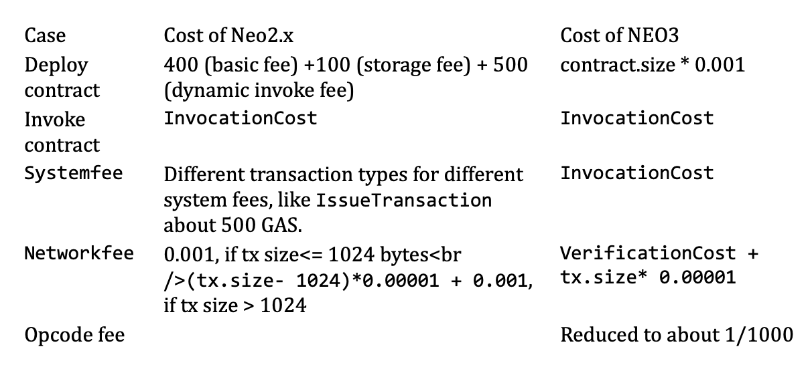

# 处理资产交易

## 简介

NEO3中只有一种资产，即NEP-5 类型的资产，使用 BALANCE 模型来管理资产。交易所对接时，主要处理这种类型资产的查询、充值、提现等操作。这三种操作的流程分别如下图所示：

   

   

   

## 网络费

网络费是用户向NEO网路提交交易时支付的费用，作为共识节点的出块奖励。每笔交易的网络费存在一个基础值，计算公式如下。只有当用户支付的网络费大于或等于此基础费用时，才会执行交易。否则将被认为无效交易。

   

其中，VerficationCost为NeoVM验证交易签名执行的指令相对应的费用，tx.size为交易数据的字节长度，FeePerByte为交易每字节的费用，目前在PolicyContract定义为0.00001 GAS。


## 系统费

系统费是根据NeoVM要执行的指令计算得出的费用，请参考Github上NEO3开发指南中的操作码费用部分(<https://github.com/neo-ngd/NEO3-Development-Guide/tree/master/en/NeoVM#contrant>)，了解每个操作码的费用。NEO3中取消了每笔交易10GAS的免费额度，系统费用总额受合约脚本的指令数量和指令类型影响，计算公式如下：

   

## 操作码费用

NeoVM操作码费用降低为原来的1/1000左右，可以显著降低合约开发成本。

- 与NEO2.x的比较

   

## 处理资产交易

### 查询

交易所由于自身管理钱包产生的查询地址余额需求和用户的查询账户余额请求是不同的。

#### 交易所查询用户地址余额

要查询用户账户余额，有两种方式，第一种是调用RPC请求getnep5balances方法：

前提条件： 安装RpcNep5Tracker插件

#### getnep5balances

在 JSON 文件中，getnep5balances 的请求正文通常为以下格式：
```json
{
  "jsonrpc": "2.0",
  "method": "getnep5balances",
  "params": ["1aada0032aba1ef6d1f07bbd8bec1d85f5380fb3"],
  "id": 1
}
```
发送请求后，将收到如下响应：
```json
{
    "jsonrpc": "2.0",
    "id": 1,
    "result": {
        "balance": [
            {
                "asset_hash": "a48b6e1291ba24211ad11bb90ae2a10bf1fcd5a8",
                "amount": "50000000000",
                "last_updated_block": 251604
            },
            {
                "asset_hash": "1aada0032aba1ef6d1f07bbd8bec1d85f5380fb3",
                "amount": "50000000000",
                "last_updated_block": 251600
            }
        ],
        "address": "AY6eqWjsUFCzsVELG7yG72XDukKvC34p2w"
    }
}
```

根据所有返回值，可以计算出用户余额为：
用户余额 = 200000000/10⁸ NEO = 2 NEO

第二种是调用RPC请求invokefunction的方式：

1. 编写 JSON 文件，使用 RPC API `invokefunction` 调用三个方法： `balanceOf`、`decimals`和 `symbol`。
2. 向 NEO RPC 服务器发送文件请求。
3. 根据返回值计算出用户余额。

#### invokefunction

在 JSON 文件中，invokefunction 的请求正文通常为以下格式：

```json
{
  "jsonrpc": "2.0",
  "method": "invokefunction",
  "params": [
    "script hash",
    "method name",
    [
      {
        "optional arguments"
      }
    ]
  ],
  "id": 1
}
```

查询用户余额时，你需要替换上例中的这些字符：

**script hash**

要查询的 NEP-5 币的散列值，例如，RPX 的散列值是：*0xecc6b20d3ccac1ee9ef109af5a7cdb85706b1df9*

NEO散列值是： *0x43cf98eddbe047e198a3e5d57006311442a0ca15*       

GAS散列值是：  *0xa1760976db5fcdfab2a9930e8f6ce875b2d18225*

**method name**

要调用的方法。要查询用户余额，需要调用以下三个方法：

balanceOf

- 语法：`public static BigInteger balanceOf(byte[] account)`
- 说明：“balanceOf” 返回 "account'' 的余额。

decimals

- 语法：`public static byte decimals()`
- 说明： "decimals" 返回代币使用的小数位数。

symbol

- 语法：`public static string symbol()`
- 说明：”symbol“ 返回币种符号。


- optional arguments

  可选。如果调用的方法需要参数，可以将这些参数构造成一个数组传入。例如，NEP-5 的 "balanceOf"返回 "account" 的余额：

  `public static BigInteger balanceOf(byte[] account)`

  因此，你需要把 account 作为 "balanceOf" 方法的一个参数。

#### 调用示例

##### **调用 balanceOf**

假设用户账户地址是 AKibPRzkoZpHnPkF6qvuW2Q4hG9gKBwGpR，你需要将其转换为 Hash160 类型并将此参数构造为 JSON 对象，如下所示:

```json
{
    "type": "Hash160",
    "value": "0xa7274594ce215208c8e309e8f2fe05d4a9ae412b"
}
```

然后编写如下 JSON 消息：

请求正文：

```json
{
  "jsonrpc": "2.0",
  "method": "invokefunction",
  "params": [
    "0xecc6b20d3ccac1ee9ef109af5a7cdb85706b1df9",
    "balanceOf",
    [
      {
        "type": "Hash160",
        "value": "0xa7274594ce215208c8e309e8f2fe05d4a9ae412b"
      }
    ]
  ],
  "id": 3
}
```

发送请求后，将收到如下响应：

```json
{
    "jsonrpc": "2.0",
    "id": 3,
    "result": {
        "script": "142b41aea9d405fef2e809e3c8085221ce944527a751c10962616c616e63654f6667f91d6b7085db7c5aaf09f19eeec1ca3c0db2c6ec",
        "state": "HALT",
        "gas_consumed": "0.338",
        "stack": [
            {
                "type": "ByteArray",
                "value": "00c2eb0b"
            }
        ]
    }
}
```

返回值”00c2eb0b“ 可以转化为整数 **200000000**。

##### **调用 decimals**

请求正文：

```json
{
  "jsonrpc": "2.0",
  "method": "invokefunction",
  "params": [
    "0xecc6b20d3ccac1ee9ef109af5a7cdb85706b1df9",
    "decimals",
    []
    ],
  "id": 2
}
```

发送请求后，将收到如下响应：

```json
{
    "jsonrpc": "2.0",
    "id": 2,
    "result": {
        "script": "00c108646563696d616c7367f91d6b7085db7c5aaf09f19eeec1ca3c0db2c6ec",
        "state": "HALT",
        "gas_consumed": "0.156",
        "stack": [
            {
                "type": "Integer",
                "value": "8"
            }
        ]
    }
}
```

返回值为整数 **8**。

##### **调用 symbol**

请求正文:

```json
{
  "jsonrpc": "2.0",
  "method": "invokefunction",
  "params": [
    "0xecc6b20d3ccac1ee9ef109af5a7cdb85706b1df9",
    "symbol",
    []
    ],
  "id": 1
}
```

发送请求后，将收到如下响应：

```json
{
    "jsonrpc": "2.0",
    "id": 1,
    "result": {
        "script": "00c10673796d626f6c67f91d6b7085db7c5aaf09f19eeec1ca3c0db2c6ec",
        "state": "HALT",
        "gas_consumed": "0.141",
        "stack": [
            {
                "type": "ByteArray",
                "value": "525058"
            }
        ]
    }
}
```

返回值 "525058" 可以被转换为币种符号 "RPX"。

##### **计算用户余额**

根据所有返回值，可以计算出用户余额为：
用户余额 = 200000000/10⁸ RPX = 2 RPX

#### 处理用户查询账户余额请求

与全局资产同理，用户的帐户余额从交易所数据库中获得。

### 充值

对交易所来说，捕获 NEP-5 类资产的充值交易
1. 通过 getblock api 获取每个区块的详情，其中便包括该区块中所有交易的详情；
2. 分析每笔交易的交易类型，过滤出所有类型为"InvocationTransaction"的交易，任何非"InvocationTransaction"类型的交易都不可能成为 NEP-5 类型资产的转账交易；
3. 调用 getapplicationlog api 获取每笔"InvocationTransaction"交易的详情，分析交易内容完成用户充值。

#### 调用 getapplicationlog

使用 [getapplicationlog](../../reference/rpc/latest-version/api/getapplicationlog.md) 这个 API 来获取交易信息。

可以看到在根目录下生成了一个 ApplicationLogs 文件夹，完整的合约日志会记录到该目录下，每笔 NEP-5 交易会记录在 leveldb 文件中，通过 API 来读取。

以下是一个 API 调用结果：

```json
{
    "jsonrpc": "2.0",
    "id": 1,
    "result": {
        "txid": "0xff488264c1abf9f5c3c17ed8071f6dd3cd809b25797a43af49316490ded8fb07",
        "executions": [
            {
                "trigger": "Application",
                "contract": "0x0110a8f666bcc650dc0b544e71c31491b061c79e",
                "vmstate": "HALT",
                "gas_consumed": "2.855",
                "stack": [
                    {
                        "type": "Integer",
                        "value": "1"
                    }
                ],
                "notifications": [
                    {
                        "contract": "0xb9d7ea3062e6aeeb3e8ad9548220c4ba1361d263",
                        "state": {
                            "type": "Array",
                            "value": [
                                {
                                    "type": "ByteArray",
                                    "value": "7472616e73666572"
                                },
                                {
                                    "type": "ByteArray",
                                    "value": "e3069da508f128069a0cd2544b0728ccbacdfb43"
                                },
                                {
                                    "type": "ByteArray",
                                    "value": "d142f89e93b2717426a8130c37dad93aad70cff5"
                                },
                                {
                                    "type": "ByteArray",
                                    "value": "00e1f50500000000"
                                }
                            ]
                        }
                    }
                ]
            }
        ]
    }
}
```

> [!Note]
>
> -  失败的 NEP-5 交易也会上链，因此需要判断虚拟机的状态项"vmstate"是否正确。
> -  "vmstate"是虚拟机执行合约后的状态，如果包含"FAULT"的话，说明执行失败，那么该交易便是无效的。

- **contract**: 该字符串为智能合约的脚本哈希，对于交易所来说，这里是相应 NEP5 类型资产的脚本哈希，交易所可以以此来确定资产的唯一性。例如，"0xb9d7ea3062e6aeeb3e8ad9548220c4ba1361d263"就是 QLC 资产的脚本哈希，是该资产在全网的唯一标识。

- 对于转账交易，"state" 中 "value" 对应的数组包含以下四个对象：

  [事件，转出账户，转入账户，金额]

- 数组中的第一个对象，类型为 bytearray，值为 "7472616e73666572"，经过转换，为字符串 "transfer"。transfer 是 NEP-5 中的一个方法，代表资产转账。
  ```json
  {
    "type": "ByteArray",
    "value": "7472616e73666572"
  }
  ```

- 数组中的的第二个对象，为转出账户地址，类型为 bytearray，值为"e3069da508f128069a0cd2544b0728ccbacdfb43"，经过转换，为字符串 "AcUGxiaPjCiD74VWiFqPzudJHZo4QMza5Q"。

  > [!Note]
  >
  > NEO 中 16 进制值如果前面加 0x，按大端序处理，如果没加 0x，按小端序处理。

  ```json
  {
    "type": "ByteArray",
    "value": "e3069da508f128069a0cd2544b0728ccbacdfb43"
  }
  ```

- 数组中的第三个对象，为转入账户地址，类型为 bytearray，值为"d142f89e93b2717426a8130c37dad93aad70cff5"，经过转换，为字符串 "AarM6q48K55EBHhuRRRPVsGByrqBKoQoWf"。对于交易所来说，如果该地址为交易所地址，那么该交易是一笔充值交易。
  ```json
  {
    "type": "ByteArray",
    "value": "d142f89e93b2717426a8130c37dad93aad70cff5"
  }
  ```

- 数组中的的第四个对象，为转账金额，类型为 bytearray，因前面没加 0x，按小端序处理, 翻转后为 0000000005f5e100, 值为 100000000, 因为 decimal 为 8 位，所以实际值就是 1.00000000。这里根据金额不同，会有两种类型，一种是 integer 类型，另一种是 bytearray 类型。交易所处理该数值时，应当特别注意，如果类型为 integer，其数值转换方式与 bytearray 不同。
  ```json
  {
    "type": "ByteArray",
    "value": "00e1f50500000000"
  }
  ```

> [!Note]
>
> 关于文件中 transfer 通知格式的转换，可以参考工具 [ApplicationLogsTools](https://github.com/chenzhitong/ApplicationLogsTools)。

### 提现

交易所可以通过以下一种方式发送 NEP-5 资产给用户，客户端侧必须打开钱包才能使用以下 API：

- neo-cli 命令： `send`
- RPC 方法： `sendfrom`
- RPC 方法： `sendtoaddress`
- RPC 方法： `sendmany`

#### neo-cli 命令：send

##### 语法

`send <txid|script hash> <address> <value> `

##### 参数

- `txid|script hash`：资产 ID。
- `address`：付款地址。
- `value`：转账金额。

该命令会检查钱包密码。

##### 示例

要将 100 RPX 转账到地址 AeSHyuirtXbfZbFik6SiBW2BEj7GK3N62b，输入以下命令：

```
send 0xecc6b20d3ccac1ee9ef109af5a7cdb85706b1df9 AeSHyuirtXbfZbFik6SiBW2BEj7GK3N62b 100
```

如果要转账neo/gas，只需要将第一个参数改为NEO/GAS对应的scriptHash。例如，
NEO: 0x43cf98eddbe047e198a3e5d57006311442a0ca15
GAS:  0xa1760976db5fcdfab2a9930e8f6ce875b2d18225

#### RPC 方法：sendfrom

 "params"  包含一个 4 个参数的数组。

`"params":[script hash, address from, address to, amount ]`

例如，要从地址 AKibPRzkoZpHnPkF6qvuW2Q4hG9gKBwGpR 发送 1 RPX 到地址 AVECC4AcGXfDjm7cGmfGuxVRGTu6FxoQ7h，编写如下 JSON 文件并发送给 RPC 服务器。

请求正文：

```json
{
  "jsonrpc": "2.0",
  "method": "sendfrom",
  "params": ["0xecc6b20d3ccac1ee9ef109af5a7cdb85706b1df9","AKibPRzkoZpHnPkF6qvuW2Q4hG9gKBwGpR","AVECC4AcGXfDjm7cGmfGuxVRGTu6FxoQ7h",1],
  "id": 1
}
```

发送请求后，将收到如下响应：

```json
{
    "jsonrpc": "2.0",
    "id": 1,
    "result": {
        "txid": "0xec413354b76fc50a614419f76f131c873da0b17e0fd2dd9170c955b667de08ef",
        "size": 219,
        "type": "InvocationTransaction",
        "version": 1,
        "attributes": [
            {
                "usage": "Script",
                "data": "2b41aea9d405fef2e809e3c8085221ce944527a7"
            }
        ],
        "vin": [],
        "vout": [],
        "sys_fee": "0",
        "net_fee": "0",
        "scripts": [
            {
                "invocation": "401743a9c3fc91f131aea1c872d166e9c6fae577647884cd8511986041561c2b3e574c1708f662e570688d1a31db7cea281d43615b7fa64d7fa3babf0f6477c31e",
                "verification": "2103c532d9335f512e1198ede5c3d35524e6a3b4598f1eb335193b09c4cd52591927ac"
            }
        ],
        "script": "0400e1f505149393ee15ce6612484ab5be3bbc78c82af8dc0e07142b41aea9d405fef2e809e3c8085221ce944527a753c1087472616e7366657267f91d6b7085db7c5aaf09f19eeec1ca3c0db2c6ecf166c72745294a433e52",
        "gas": "0"
    }
}
```

#### RPC 方法：sendtoaddress

 "params"  包含一个 3 个参数的数组。

`"params":[script hash, address, amount ]`

例如，要发送 1 RPX 到地址 AbP3FU3YcqBrWh72nc9deyQB99eazG9XUg，编写如下 JSON 文件并发送给 RPC 服务器。

请求正文：

```json
{
    "jsonrpc":"2.0",
    "method":"sendtoaddress",
    "params":[
        "0xecc6b20d3ccac1ee9ef109af5a7cdb85706b1df9",
        "AbP3FU3YcqBrWh72nc9deyQB99eazG9XUg",
        "1"
    ],
    "id":1
}
```

发送请求后，将收到如下响应：

```json
{
    "jsonrpc":"2.0",
    "id":1,
    "result":{
        "txid":"0xc6d4bf7c62fb47e0b2a6e838c3a1ca297622a1b1df7ceb2d30fa4ef8b7870700",
        "size":219,
        "type":"InvocationTransaction",
        "version":1,
        "attributes":[
            {
                "usage":"Script",
                "data":"5305fbbd4bd5a5e3e859b452b7897157eb20144f"
            }
        ],
        "vin":[

        ],
        "vout":[

        ],
        "sys_fee":"0",
        "net_fee":"0",
        "scripts":[
            {
                "invocation":"4054fbfca678737ae164ebf0e476da0c8215782bc42b67ae08cf4d8a716eeef81fcc17641e7f63893c3e685fb7eb1fb8516161c5257af41630f4508dde3afa3a8c",
                "verification":"210331d1feacd79b53aeeeeb9de56018eadcd07948675a50258f9e64a1204b5d58d1ac"
            }
        ],
        "script":"0400e1f50514d710f6f3f0bad2996a09a56d454cfc116a881bfd145305fbbd4bd5a5e3e859b452b7897157eb20144f53c1087472616e7366657267f91d6b7085db7c5aaf09f19eeec1ca3c0db2c6ecf166187b7883718089c8",
        "gas":"0"
    }
}
```

#### RPC 方法：sendmany

"params"  包含一个参数的数组，而且该参数为数组格式。

`"params":[[]]`

例如，要发送 15.5 RPX 和 0.0001 GAS 到 AbP3FU3YcqBrWh72nc9deyQB99eazG9XUg，编写如下 JSON 文件并发送给 RPC 服务器。

请求正文：

```json
{
    "jsonrpc":"2.0",
    "method":"sendmany",
    "params":[
        [
            {
                "asset":"0xecc6b20d3ccac1ee9ef109af5a7cdb85706b1df9",
                "value":"15.5",
                "address":"AbP3FU3YcqBrWh72nc9deyQB99eazG9XUg"
            },
            {
                "asset":"0x602c79718b16e442de58778e148d0b1084e3b2dffd5de6b7b16cee7969282de7",
                "value":"0.0001",
                "address":"AbP3FU3YcqBrWh72nc9deyQB99eazG9XUg"
            }
        ]
    ],
    "id":1
}
```

发送请求后，将收到如下响应：

```json
{
    "jsonrpc": "2.0",
    "id": 1,
    "result": {
        "txid": "0xe1351c9c9f2205a801d1b04f0df2d65fb4b1692d7d3b06cf41e0712fd1b12c9c",
        "size": 373,
        "type": "InvocationTransaction",
        "version": 1,
        "attributes": [
            {
                "usage": "Script",
                "data": "6d64dc9e50af8e911247436b264c8f7d791ad58c"
            }
        ],
        "vin": [
            {
                "txid": "0x9f0a28a912527604ab4b7d5e8b8d1a9b57631fcbab460132811ae7b6ed1ccaff",
                "vout": 1
            }
        ],
        "vout": [
            {
                "n": 0,
                "asset": "0x602c79718b16e442de58778e148d0b1084e3b2dffd5de6b7b16cee7969282de7",
                "value": "0.0001",
                "address": "AbP3FU3YcqBrWh72nc9deyQB99eazG9XUg"
            },
            {
                "n": 1,
                "asset": "0x602c79718b16e442de58778e148d0b1084e3b2dffd5de6b7b16cee7969282de7",
                "value": "0.01359",
                "address": "AbP3FU3YcqBrWh72nc9deyQB99eazG9XUg"
            }
        ],
        "sys_fee": "0",
        "net_fee": "0.00001",
        "scripts": [
            {
                "invocation": "40644ab915419dbf855a52d5c75596e80b78c8e928cc0ce91ae6afc3b75a0c31ee54efe1836f9ec232f6c42dcb3ace0bfdc688e626944fa20970a76064975eade9",
                "verification": "2103d4b6fc2d116855f86a483d151182f68e88e6ddd13f3f1f3631e36300aac122bfac"
            }
        ],
        "script": "04801f635c14d710f6f3f0bad2996a09a56d454cfc116a881bfd146d64dc9e50af8e911247436b264c8f7d791ad58c53c1087472616e7366657267f91d6b7085db7c5aaf09f19eeec1ca3c0db2c6ecf166f871fb30fc859b77",
        "gas": "0"
    }
}
```

## 相关参考

[NEP-5 Token Standard](https://github.com/neo-project/proposals/blob/master/nep-5.mediawiki "NEP5") 

[数据转换示例](https://github.com/PeterLinX/NeoDataTransformation)
