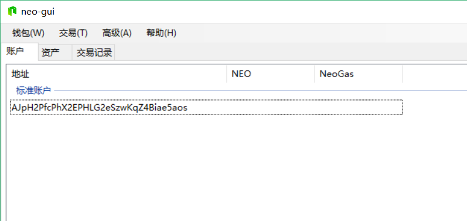

# 钱包

钱包用来存储 NEO 账户及账户中的资产信息，是 NEO-GUI 的钱包数据库文件，以 .json 或.db3 为后缀名称。该文件非常重要，需要**安全备份**。

> [!CAUTION]
>
> #### 警告
>
> 钱包文件或钱包密码一旦丢失，将导致您资产的损失。所以请将钱包文件安全备份，妥善保管，并牢记钱包密码。

## 创建钱包数据库

1. 在 NEO-GUI 中点击 `钱包` -> `创建钱包数据库`。

2. 在 `新建钱包` 页面中点击 `浏览`，选定钱包文件存储位置，并设置好文件名称，然后点击保存。

3. 输入 `密码` 与 `重复密码` ，并保存好自己的密码。

4. 点击 `确定` 后，钱包创建成功，此时钱包里会默认带有一个标准账户。

   右键单击钱包可以创建更多地址。

   > [!Note]
   >
   > 因找零机制的作用，根据转账金额，转账后的剩余部分资产会默认转到第一个地址里，所以需备份好相应的私钥与钱包。

## 查看钱包信息

### 账户

右键单击钱包中的 `账户` -> `查看私钥`，可以查看该账户信息：

- 地址：相当于银行账户或银行卡号，用于交易时接收资产。 
- 私钥：一个 256 位的随机数，由用户保管且不对外公开，是用户账户使用权以及账户内资产所有权的证明。 
- 公钥：每一个私钥都有一个与之相匹配的公钥。

> [!CAUTION]
>
> #### 警告
>
> 任何时刻不要向他人泄露私钥，私钥一旦泄露，很可能会导致您资产的损失。

在账户列表中右键单击某地址，还可以进行以下功能操作：

| 功能         | 说明                                                         |
| ------------ | ------------------------------------------------------------ |
| 创建新地址   | 在钱包内创建一个新地址                                       |
| 导入         | 导入wif：将私钥对应的地址导入钱包 导入证书: 导入证书  导入监视地址：导入对方的地址作为监视地址后，便可以看到该地址上的资产情况。 |
| 复制到剪贴板 | 复制该账户地址                                               |
| 删除         | 删除该地址                                                   |

### 资产

点击 `资产` 页签，可以查看该钱包所拥有的资产信息，资产信息包括：资产（NEO、Gas、用户所创设的资产）、类型、余额和发行者。

### 交易记录

点击 `交易记录` 页签，可以查看与该钱包有关的所有交易信息记录。

## 打开钱包数据库

1. 每次重新打开 NEO-GUI 时，都需要点击 `钱包` -> `打开钱包数据库` 来选择要打开的钱包。默认显示上一次打开的钱包。

2. 要打开其他钱包，点击 `浏览` 选择钱包。

3. 在对话框中选择要打开的文件类型：NEP-6 钱包文件（.json）或 SQLite 钱包文件（.db3）

   Neo GUI v2.5.2 以前版本仅支持 .db3 格式文件。

4. 输入密码，点击 `确定` 后进入钱包。

5. 如果打开的是旧的 .db3 钱包文件，需要根据提示选择是否升级到 NEP-6 格式钱包。

   升级文件格式后钱包可以在多个客户端之间共享，比如手机、PC 或 Web 端，但升级后的钱包文件无法在 Neo GUI v2.5.2 以前版本客户端打开。

## 修改钱包密码

在 NEO-GUI 中点击 `钱包` -> `修改秘密`。

修改密码后请记得重新备份钱包，因为之前备份的钱包密码未变。

## 重建钱包索引

在 NEO-GUI 中点击 `钱包` -> `重建钱包索引`。

该选项用于恢复出现异常时客户端内有误的数据。在以下情况下可能需要重建钱包索引：

- 导入私钥后需要重建钱包索引
- 某笔交易长时间未确认
- 钱包内资产显示错误，与区块链数据不符
- 在测试网和主网之间进行切换时

目前区块高度较高，重建钱包索引大概需要 15-20 分钟，请耐心等待。