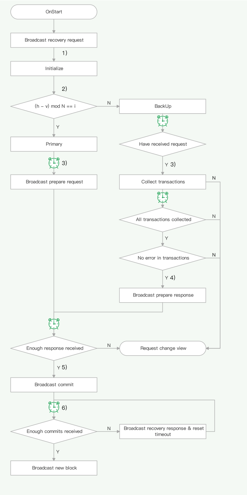
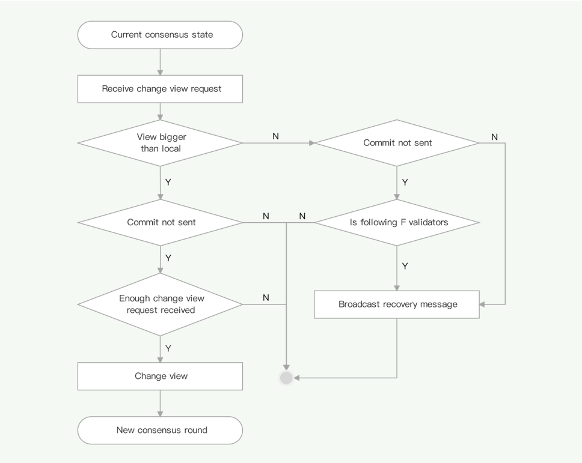
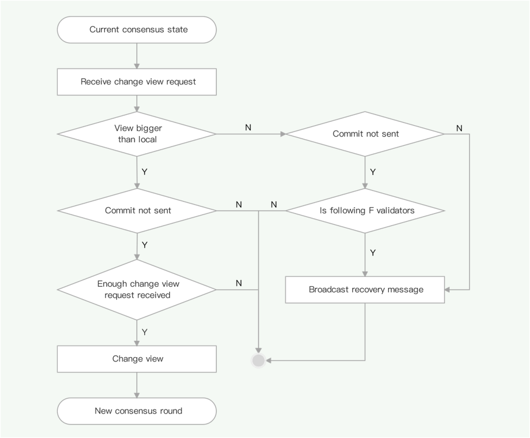

# dBFT 2.0 算法

NEO 在PBFT（Practical Byzantine Fault Tolerance， 实用拜占庭容错）算法的基础上，提出了dBFT（delegated Byzantine Fault Tolerance， 委托拜占庭容错）共识算法。算法根据区块链实时投票情况，决定下一轮参与共识的节点，有效降低了算法耗时，从而提高了出块速度，同时降低了交易确认周期。2019年3月又在原dBFT算法的基础上提出了升级版算法dBFT2.0，引入了三阶段共识机制和恢复机制，进一步提升了算法的鲁棒性和安全性。

## 共识术语

| **名称** | 定义                                                         |
| -------- | ------------------------------------------------------------ |
| 共识节点 | 具有发起新块提案和提案投票权限的节点                         |
| 普通节点 | 具有转账、交易权限和全网账本，但不能发起区块提案与投票       |
| 议长     | 负责向其他节点广播新块提案                                   |
| 议员     | 参与共识出块的账户，负责对新块提案进行投票                   |
| 候选人   | 被提名有权参与共识节点投票的账户                             |
| 共识节点 | 从候选人中被选出的，参与共识的账户                           |
| 视图     | 一轮共识从开始到结束所使用的数据集。视图编号*v*，从 0 开始，本轮共识失败时*v* 逐渐递增，直到新的提案通过后重置 |

## 共识消息

dBFT 2.0算法包含6种共识消息：

| **名称**            | **描述**                                     |
| ------------------- | -------------------------------------------- |
| Prepare  Request    | 发起新一轮共识的信息                         |
| Prepare  Response   | 用来通知其他节点已获取构建区块的全部交易信息 |
| Commit              | 通知其他节点已获取了足够多的Prepare Response |
| Change View Request | 尝试改变视图的信息                           |
| Recovery Request    | 同步共识状态的请求                           |
| Recovery Message    | 对Recovery Request的响应信息                 |

## 共识流程

### 三阶段共识流程

如图所示，一轮共识具有以下4个步骤：

1. 议长发起共识，广播Prepare Request；
2. 接收到Prepare Request后，议员广播Prepare Response；
3. 接收到足够多的Prepare Response后，共识节点广播Commit；
4. 接收到足够多的Commit后，共识节点产生新块并广播。

这里引入两个变量：

​                                  

其中，*N*为共识节点的总数。

常规情况的算法流程如下图所示。

##### 1) 初始化本地共识信息

1. 重置共识上下文；
2. 设置编号为 *(h - v) mod N*  的共识节点为本轮共识的议长，其中，*h*为区块高度，*v*为当前视图编号，*N*为共识节点数目；
3. 设置超时时间，议长为  *Tblock* （区块周期，当前为15s），议员为 2v+1 *Tblock  ；
4. 向其他节点发送 Recovery Request 获取当前共识状态。

##### 2) 各共识节点超时前监听网络，收集交易信息

##### 3) 发起共识

- 议长：
  1. 在 *Tblock* 后按照共识策略从内存池中选取交易，取哈希打包为Prepare Request并广播，发起新一轮共识；
  2. 将选出的交易信息每500个打包并广播；
  3. 将超时时间设置为 (2v+1 - k(v))*Tblock ，其中   。

- 议员：

   - 若在超时前接收到议长发出的Prepare Request：
   
     1. 验证消息的合法性，以及是否符合本地共识状态；
   
     2. 将本节点的超时时间延长   ；
   
     3. 更新本地共识状态；
   
     4. 对于消息包含的交易哈希，尝试从内存池或未确认的交易中获取相应交易，并添加至共识模块；
   
     5. 向其他节点查询步骤4中未在本地找到的交易信息。
   
   - 若没有在超时前接收到议长发出的Prepare Request，则会尝试改变视图。

##### 4) 广播Prepare Response

- 议员若在超时前收集到Prepare Request中全部交易信息:
  1. 对于每一条交易信息：若交易验证失败或不符合共识策略，尝试改变视图；否则将交易添加至共识模块；
  2. 广播Prepare Response信息；
  3. 将本节点的超时时间延长。
- 否则，尝试改变视图。

##### 5) 收集Prepare Response & 广播Commit

- 议长以及接收到Prepare Request的议员，若在超时前收集到至少*M*个议员的Prepare Response：
   - 对于每一条Prepare Response：
     1. 验证消息的合法性，以及是否符合本地共识状态；
     2. 将本节点的超时时间延长。
   - 广播 Commit 信息。
- 否则，尝试改变视图。

##### 6) 收集Commit信息 & 出块

- 每个已收集齐Prepare Request中交易信息的共识节点，若在超时前收集到至少*M*个共识节点的Commit：
   - 对于每一条Commit：
     1. 验证消息的合法性，以及是否符合本地共识状态；
     2. 将本节点的超时时间延长。
   - 生成并广播新块。
- 否则，广播Recovery Message，并将超时时间设置为 2*Tblock  。

##### 7)  回到第1步，开始下一轮共识

### Change View Request 消息

#### 触发场景

- 议员在验证交易出现问题时，会广播Change View Request尝试更换议长;

- 议员等待议长的Prepare Request超时，或等待Prepare Response超时，广播Change View Request信息尝试更换议长。

#### 流程

1. 将超时时间设置为 2v+2 * Tblock  ；

2. 若已经发出Commit信息的节点和故障节点（超过一个区块高度没有收到过其共识信息的共识节点）数目之和大于*F*，则广播Recovery Request信息；

3. 否则，广播Change View Request信息，并检查已收到的Change View Request数目：若超过*M*个共识节点就更换视图达成共识，则改变本地视图，初始化本地共识信息，并根据新的视图编号确认下一轮议长。

#### 处理逻辑

当共识节点收到Change View Request时：

1. 若信息的视图不大于本地视图，该信息作为Recovery Request处理；

2. 验证消息的合法性；

3. 检查已收到的Change View Request数目：若超过*M*个共识节点就更换视图达成共识，则改变本地视图，初始化本地共识信息，并根据新的视图编号确认下一轮议长。

### Recovery Request 消息

#### 触发情景

- 开启共识节点会广播Recovery Request信息，以同步至最新共识状态；

- 发起Change View Request的时候，若缺少足够的活跃共识节点连接（已经发出Commit信息的节点和故障节点数目之和大于*F*）的时候，向网络广播Recovery Request消息，以将数据同步至最新共识状态。

#### 处理逻辑

共识节点收到Recovery Request时，只有满足以下条件，才会生成并广播Recovery Message。

- 本节点在本轮共识发送过Commit信息；
-  或编号在议员列表中在以下范围内：，其中 *j* 为 Recovery Request 发起者的编号。

### Recovery Message 消息

#### 内容

- 不超过*M*个议员的上次Change View Request信息；

- 本节点和其他共识节点Prepare Request/Response信息；

- 各共识节点的Commit信息。

#### 触发情景

- 收到Recovery Request，且本节点发送过Commit信息，或编号在议员列表中在以下范围内：，其中 *j* 为Recovery Request发起者的编号；

- 收到Change View Request信息时，若信息的视图不大于本地视图，该信息作为Recovery Request处理；

- 等待Commit超时，通过发送Recovery Message，再次广播Commit信息（常见于网络问题）；

#### 处理逻辑

1. 验证消息的合法性，以及本地共识状态：消息的视图大于本地视图，且本节点已经在本轮发送过Commit，则忽略该消息；

2. 否则，若信息的视图大于本地视图：处理信息中包含的Change View Request；

3. 若信息的视图等于本地视图：

   - 处理信息中包含的Prepare Request：

     1. 若本地未发送或接受到Prepare Request，接收信息中包含的Prepare Request；

     2. 否则，若本节点为议长，广播Prepare Request信息。

   - 处理信息中包含的Prepare Response。

4. 若信息的视图小于等于本地视图：处理信息中包含的Commit。

Change View Request，Recovery Request和Recovery Message机制能够避免网络原因导致的超时，异常节点（作恶节点，故障节点等非正常共识节点）等问题带来的影响。

## 共识策略

共识流程中的以下场景会使用共识策略：

- 当节点接收到来自其他节点的交易信息时，需要验证该交易是否满足现有共识策略的过滤条件，以便过滤掉不符合策略的交易；

- 共识模块接收到交易信息时，需要验证该交易是否满足共识策略；若不满足，则尝试改变视图；

- 启动共识时，需要使用共识策略对共识模块中的交易进行过滤。在将未确认的交易过滤后，才能将交易添加到内存池中；

- 议长在生成新的Prepare Request时，需要通过共识策略从当前内存池中筛选出可以上链的交易。
